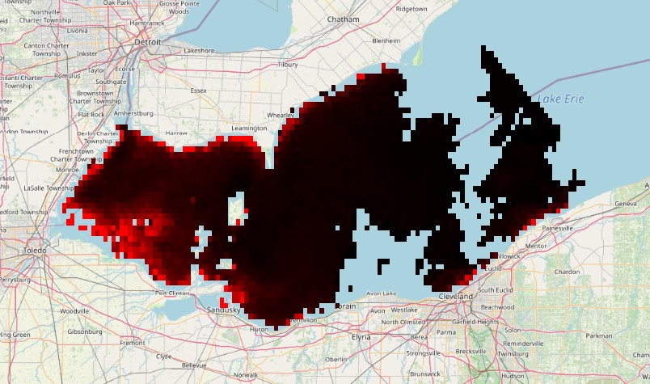
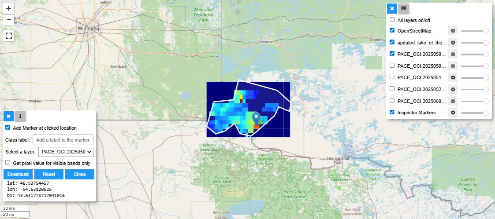
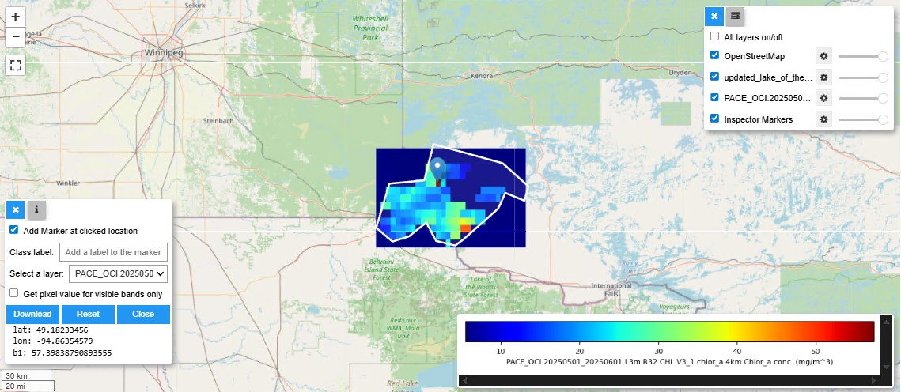

# NASA-PACE-Initial-Data-Processing

Initial data processing pipeline for NASA PACE satellite data, tested on L2 BGC and L3 chlor_a (in progress).



---

### Contents
1. simple_pace_gtiff_conversion.py
2. full_pace_data_crop_valid.py
3. interactivemap_gtif.ipynb
4. environment.yml

### Environment Setup
First, make a new conda environment using environment.yml:

```bash
conda env create -n pace-processing-env -f environment.yml
```

Activate the environment:
```bash
conda activate pace-processing-env
```

### Creating Shape Files to Select Polygon Areas of Interest
I would recommend installing QGIS if you would like to create your own custom shape files to selectively crop your data. It is free to download here: https://qgis.org/download/

Follow the steps below:
1. Insert a map layer (XYZ Tiles) of your choice, such as Google Maps Satellite view. You will be drawing on top of this map to select the desired polygon area.
2. Create a new Shapefile layer. Set the name of the file, and ensure that the dropdown selection is set to "Polygon."
3. Once you have created the layer, select it and click on the Pen icon to draw a polygon shape on the map.
4. When you have closed the shape, right-click on the shapefile layer and export as a shape file (I recommend geoJSON format).
5. Save the file to a directory of your choice.

## simple_pace_gtiff_conversion.py

Working with NASA PACE data, comes with a few complications. For instance, the netCDF files for L2 BGC data contain 8 subdatasets (5 variables, flags, longitude, and latitude). The variables are not projected to a coordinate system, which would be required for GIS applications.  

`simple_pace_gtiff_conversion.py` handles the reprojection of datasets and saves them as geoTIFF files. General procedure for L2 reprojection is as follows:
1. Masking of quality issues/obscured pixels (i.e. clouds)
2. Setting coordinates to latitude and longitude from navigation_data group
3. Assigning spatial dimensions as columns and rows (pixels per line and number of lines, respectively)
4. Assigning coordinate reference system (crs)
5. Performing reprojection

L3 data is pre-masked and mapped to Plate Carree projection, so we simply write the CRS if we want and convert to geoTIFF format.

See https://github.com/PACEHackWeek/pace-2025/blob/main/book/presentations/notebooks/oci_project_and_format.ipynb for similar data processing examples for the SFREFL and LANDVI datsets!

### Example Use-Case

Example: Conversion of L2 2D data

```python
from simple_pace_gtiff_conversion import l2_2d
l2_2d(file="level2_bgc\lake_erie_west\2025-12-10\15_05_53_PACE_OCI_L2_BGC\PACE_OCI.20250603T181505.L2.OC_BGC.V3_1.nc", var="chlor_a", user_crs="epsg:4326", output="target_data_tif")
```

Alternatively, to process all data in a directory, modify the values for the `parent_dir` and `output_root_dir` directly in the file and run.

```bash
python simple_pace_gtiff_conversion.py
```

## full_pace_data_crop_valid.py
After running the `simple_pace_gtiff_conversion,py`, the resulting geoTIFF files can be cropped and filtered. `full_pace_data_crop_valid.py` will first crop the data to a specified polygon shape file, then filter and selectively save data that contains less than a threshold percentage of NaN values.

~~Currently, this works for L2 chlorophyll-a data, but updates may be made to process other L2 and L3 data.~~

**Update:** Now working for all processed L2 and L3 data.

### Example Use-Case
The following variables should be modified to your custom paths:

```python
filespath #the specific directory to be looped through, containing all of your TIFF files
parent_dir #the parent directory of filespath that is shared with the save directory, for fast naming purposes
savepath #the save directory name
threshold #the threshold value to filter out NaN values (i.e. threshold=0.1 will filter out all data that has more than 90% NaN values)
area_boundary_path #the vector data file to be used for cropping the geoTIFF
```

After making changes, run:
```bash
python full_pace_data_crop_valid.py
```
## interactivemap_gtif.ipynb
This notebook is for visualizing the final cropped datasets to validate that the cropping is correct. Follow instructions to open data and display an interactive map with the OpenStreetMap basemap and adjustable custom overlaid layers. Layers are automatically ordered in alphabetical and temporal order (i.e. oldest data will be at the top, and most recent data will be at the end).

**Update:** Removed unnecessary widgets and added an inspection widget, which allows you to add a marker anywhere, select a data layer, and shows the band value. 

Also tested the notebook with L3 chlorophyll-a data, as shown in the figure below (note the lower resolution with L3 data):  



There is an additional option to add colourmaps (legend) but due to the way colourmaps are displayed on leafmap, it only works well with 1-3 layers selected. Otherwise, the colourmaps will fill up the entire display. Could consider implementing a custom widget to handle the colourmaps, linking them to the layer toggle button status, or adding them as extra individual layers which can be handled by a layer_manager.

